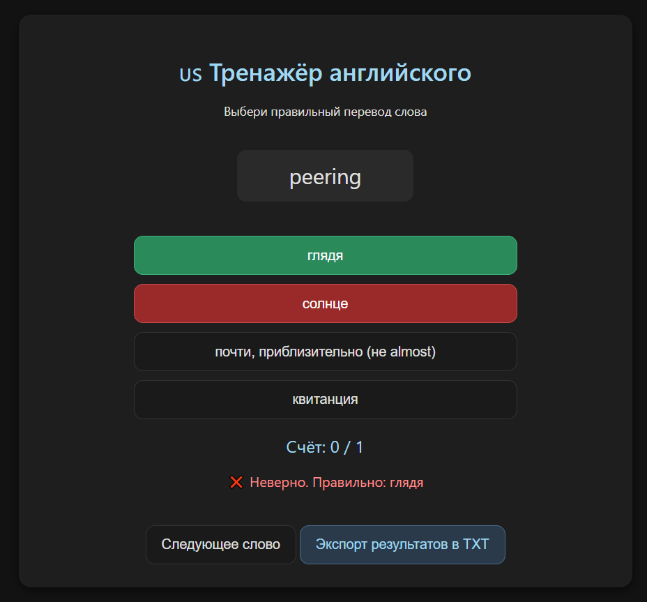

# English Trainer  
### 8040 слов. Никакого интернета. Ни одной рекламы. Только ты и английский.

> Простой, быстрый и **полностью локальный** тренажёр для запоминания английских слов.  
> Скачай — открой — тренируйся.  
> Работает даже на телефоне, если включить «Режим офлайн» 📱✨

## ✨ Особенности

- ✅ **Всё в одном файле** — HTML + JS + CSS в одном `english-trainer.html`  
- ✅ **Нет сервера** — не нужен localhost, не нужен Node.js, не нужен Apache  
- ✅ **Нет интернета** — работает даже в метро, в самолёте, в деревне  
- ✅ **Нет регистрации** — ты не оставляешь ни одной строчки данных  
- ✅ **Нет рекламы** — чисто, как утро после кофе ☕  
- ✅ **8040 слов** — база от A1 до B2, с переводом и примерами  
- ✅ **Лёгкий** — 400 КБ, грузится мгновенно  
- ✅ **На любом устройстве** — Chrome, Firefox, Safari, даже на старом Android

## 📦 Файлы

| Файл | Описание |
|------|----------|
| `english-trainer.html` | **Браузерная версия** — всё в одном файле, запускается через `file://`. |
| `english-trainer-local.html` | **Серверная версия** — для запуска через `localhost` (например, Live Server). |

## 🚀 Как использовать

### Вариант 1: Браузерная версия
1. Скачай файл `english-trainer.html`.
2. Открой его в браузере (двойной клик).
3. Начинай тренироваться!

### Вариант 2: Серверная версия
1. Скачай архив с проектом.
2. Запусти через `localhost` (например, через VS Code Live Server).
3. Открой `english-trainer-local.html`.

> Подходит как для новичков, так и для тех, кто просто хочет освежить словарный запас.

## 🎨 Что внутри

- Чистый HTML5 + CSS3 + Vanilla JS  
- Никаких фреймворков, никаких библиотек  
- Интерфейс с плавными переходами, кнопками и светлыми акцентами — как у твоего любимого сайта  
- Поддержка русского языка — от слова «привет» до «гиперболизация»

## 🤝 Вклад приветствуется

Хочешь улучшить?  
Ты можешь:  
- 📥 Добавить новые слова (формат: `{ en: "apple", ru: "яблоко" }`)  
- 🌙 Сделать тёмную тему (уже в планах — но ты можешь начать)  
- 🔊 Добавить аудио произношение (если найдёшь бесплатные WAV/MP3)  
- 📊 Добавить статистику: «Сколько слов выучил за неделю?»  
- 🧠 Сделать режим «Случайный выбор» или «Трудные слова»  

Просто создай Pull Request — я сам буду рад, если кто-то добавит слово «sophisticated» 😉

## 📜 Лицензия

**MIT** — делай, что хочешь.  
Можешь переименовать, продавать, встраивать в приложение — главное:  
> *Не удаляй авторство. И не делай из этого монструозный SaaS с подпиской.*

## 🏷️ Теги  
`#englishlearning #htmlapp #languagelearning #offlineapp #nojavascriptneeded #learnenglishwithden`

> Автор: **Den (Hexxeh777-svg)**  
> Создано в духе: *«Если хочешь что-то сделать — сделай сам. И пусть работает.»*